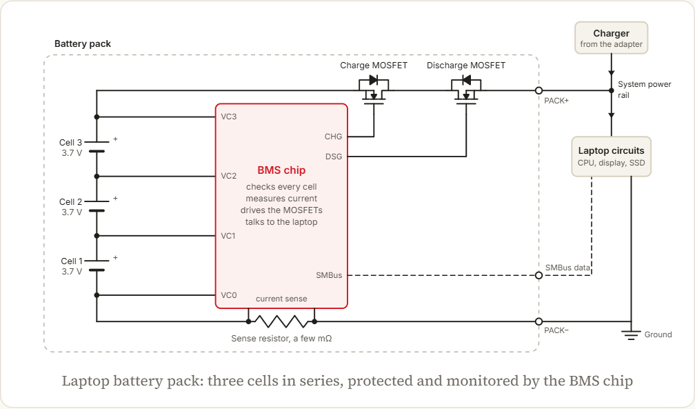
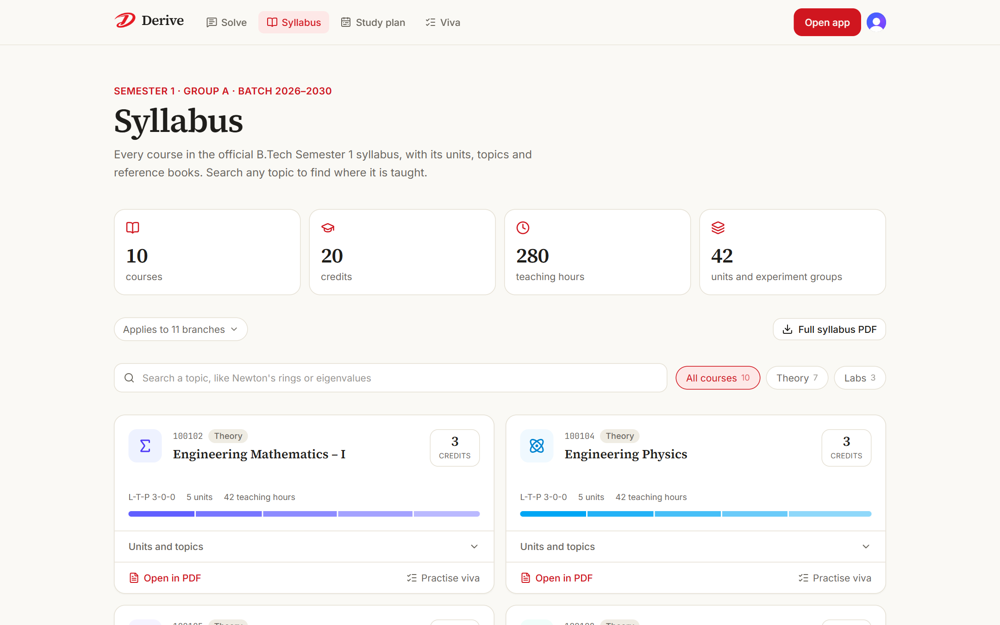
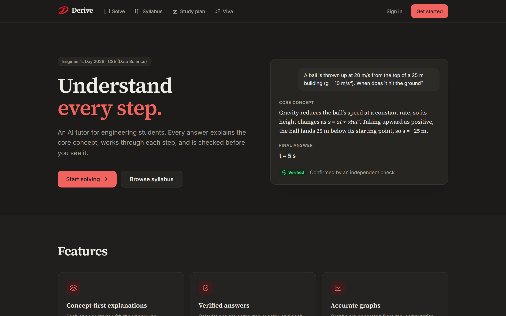
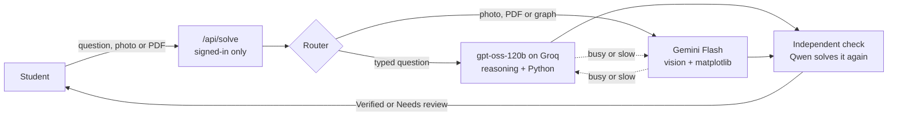
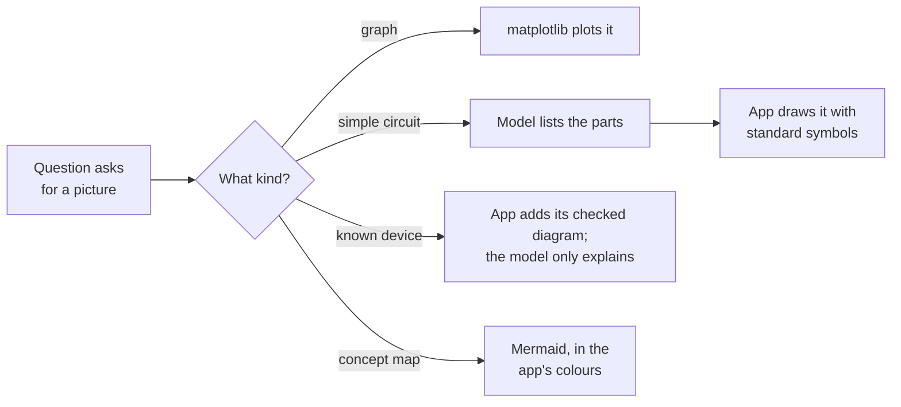
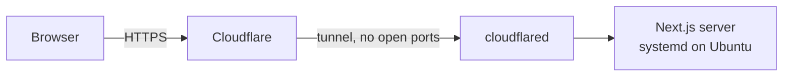

<div align="center">


# Derive

### Understand every step.

An AI tutor for engineering students that explains the concept behind every answer, works through each step, draws graphs and circuits with real code, and checks the result independently before you see it.

[](https://deriveai.online)
[](https://github.com/daniyalsadique9-commits/derive/actions/workflows/ci.yml)
[](LICENSE)


**[Live site](https://deriveai.online)** · **[Features](#features)** · **[How it works](#how-it-works)** · **[Code overview](#code-overview)** · **[Getting started](#getting-started)**

<br />


<sub>Built by <b>Daniyal Sadique</b>, first-year B.Tech CSE (Data Science), for <b>Engineer's Day 2026</b>.</sub>

</div>

<br />

## About

Derive is for first-year engineering students who need more than a final result: where a formula comes from, why each step follows, and how to check the answer by hand. Every question is answered in the same teaching structure, numbers are computed with code, and a second model solves the question again before the answer is marked **Verified**.

## Features

<table>
<tr>
<td width="50%" valign="top">

### Answers

- Every answer follows the same structure: question, prerequisites, core concept, solution, final answer, verification, common mistakes and related concepts.
- Numbers are computed in a Python sandbox, and a model from a different family solves the question again. An answer is flagged only if a second checker also disagrees.
- Three explanation styles: intuitive, formal or real-world analogy.
- Simple English or Hinglish, with technical terms, formulas and headings kept in English.
- One-click follow-ups: go deeper, simplify, practice questions (similar, harder and trick), other methods, and explain back with feedback.

</td>
<td width="50%" valign="top">

### Diagrams and graphs

- Graphs are plotted with matplotlib rather than drawn by the model, and only the final graph is shown.
- Circuits are drawn with standard symbols by the app's own SVG renderer, from a list of parts.
- A laptop battery pack, a laptop, a charger or SMPS, a UPS or inverter and a regulated power supply have checked diagrams built into the app. For these, the model writes only the explanation.
- Concept maps use the app's colours, and every figure can be opened full screen.

</td>
</tr>
<tr>
<td width="50%" valign="top">

### Syllabus tools

- A syllabus browser with all ten Semester 1 (Group A) courses: codes, credits, units, topics and hours, linked to the right page of the official PDF.
- Week-by-week study plans built only from the syllabus, based on confidence in each course, available time and goal. Every task names its course and unit.
- Viva practice for any course or lab, with a formula sheet and model answers.

</td>
<td width="50%" valign="top">

### Other features

- Questions from photos and PDFs: handwritten problems, textbook figures, circuit diagrams and question papers.
- Answers keep streaming while you move to another page.
- Searchable history with bookmarks, stored in the browser.
- Light and dark themes on desktop and phone.
- An admin panel with maintenance mode, feature switches, limits and live capacity, behind a separate username and password.

</td>
</tr>
</table>

## Screenshots

<table>
<tr>
<td width="50%"><br /><sub><b>Checked circuit diagram.</b> A laptop battery pack with per-cell sensing, back-to-back MOSFETs and the system power rail, drawn by the app.</sub></td>
<td width="50%"><br /><sub><b>Syllabus browser.</b> Every course, unit and topic, searchable, with teaching hours per unit.</sub></td>
</tr>
<tr>
<td width="50%"><br /><sub><b>Landing page</b>, light theme.</sub></td>
<td width="50%"><br /><sub><b>Landing page</b>, dark theme.</sub></td>
</tr>
</table>

<p align="center"><br /><sub><b>On a phone.</b></sub></p>

## How it works

### Answering and verifying



1. A reasoning model works through the problem before writing, under strict rules: one final answer, stated assumptions, and no agreeing with a wrong claim.
2. Numbers come from code, not from predicting digits.
3. A model from another family solves the question from scratch. Only numeric results are checked, and a disagreement must be confirmed by a second checker.
4. If a model is busy, slow to start or out of quota, the next one takes over across keys and providers. Answers stream as they are written.

### Drawing diagrams



Language models draw diagrams unreliably, so Derive never shows diagram source: whatever the model writes is either drawn by code or removed before it reaches the student.

## Code overview

| Where                                                                                      | What it does                                                            |
| ------------------------------------------------------------------------------------------ | ----------------------------------------------------------------------- |
| [`src/lib/ai/solve.ts`](src/lib/ai/solve.ts)                                               | Picks the models for a question and runs the independent check          |
| [`src/lib/ai/fallback.ts`](src/lib/ai/fallback.ts)                                         | Streams the first model that responds, with timeouts and quota tracking |
| [`src/lib/ai/verify.ts`](src/lib/ai/verify.ts)                                             | Second-model checking, with a confirming checker before flagging        |
| [`src/lib/ai/prompts.ts`](src/lib/ai/prompts.ts)                                           | The teaching structure and rules every answer follows                   |
| [`src/lib/ai/device-diagrams.ts`](src/lib/ai/device-diagrams.ts)                           | Checked device diagrams, and the filter that removes model-drawn ones   |
| [`src/components/markdown/CircuitDiagram.tsx`](src/components/markdown/CircuitDiagram.tsx) | SVG circuit renderer with standard symbols                              |
| [`src/components/markdown/schematics/`](src/components/markdown/schematics/)               | Hand-laid schematics, such as the laptop battery pack                   |
| [`src/app/api/solve/route.ts`](src/app/api/solve/route.ts)                                 | Streaming answer endpoint (NDJSON with a heartbeat)                     |
| [`src/lib/client/solver-session.ts`](src/lib/client/solver-session.ts)                     | Keeps an answer streaming while you browse other pages                  |
| [`src/lib/ai/plan.ts`](src/lib/ai/plan.ts), [`src/lib/ai/viva.ts`](src/lib/ai/viva.ts)     | Study plans and viva questions built from the syllabus                  |
| [`src/lib/server/admin-session.ts`](src/lib/server/admin-session.ts)                       | Signed admin sessions with a lockout after failed attempts              |
| [`src/data/syllabus.ts`](src/data/syllabus.ts)                                             | The official Semester 1 syllabus as data                                |

<details>
<summary><b>Full project structure</b></summary>

```
src/
├── app/
│   ├── api/solve/        Streaming answer endpoint (NDJSON)
│   ├── api/plan/         Streaming study plan endpoint
│   ├── api/viva/         Streaming viva questions endpoint
│   ├── api/admin/        Admin state, controls and sign-in
│   ├── api/status/       Live capacity report
│   ├── solve/            Solver (signed-in only)
│   ├── plan/             Study plan builder
│   ├── viva/             Viva practice
│   ├── admin/            Admin panel (administrators only)
│   ├── syllabus/         Syllabus browser
│   ├── sign-in/, sign-up/
│   └── page.tsx          Landing page
├── components/
│   ├── solver/           Composer, answers, sidebar, capacity indicator
│   ├── markdown/         Markdown, KaTeX, Mermaid, circuit and schematic rendering
│   └── site/, admin/, brand/, plan/, viva/, syllabus/, ui/
├── lib/
│   ├── ai/               Prompts, providers, fallback routing, quota, verification, checked diagrams
│   ├── client/           Streaming client, conversation state, history, image compression
│   └── server/           Access control, admin settings, rate limiting, streaming responses
├── data/syllabus.ts      Semester syllabus: courses, units, topics and books
└── proxy.ts              Route protection
scripts/smoke.mts         End-to-end pipeline check
```

</details>

## Tech stack

| Layer          | Choice                                                                    |
| -------------- | ------------------------------------------------------------------------- |
| Framework      | Next.js 16 (App Router), React 19, TypeScript                             |
| Styling        | Tailwind CSS 4, Typography plugin, Inter, Source Serif 4                  |
| Auth           | Clerk                                                                     |
| Solver         | Groq `openai/gpt-oss-120b` with built-in code execution                   |
| Verifier       | Groq `qwen/qwen3.8-27b`, with fallbacks to other models                   |
| Vision, graphs | Google Gemini Flash with code execution (matplotlib)                      |
| Rendering      | react-markdown, KaTeX for maths, Mermaid for block diagrams, SVG circuits |
| Validation     | Zod                                                                       |
| Hosting        | Ubuntu server, systemd, Cloudflare Tunnel                                 |

## Getting started

**You need** Node.js 20 or newer, and API keys from [Google AI Studio](https://aistudio.google.com/apikey) and [Groq](https://console.groq.com/keys).

```bash
git clone https://github.com/daniyalsadique9-commits/derive.git
cd derive
npm install
cp .env.example .env.local                 # add your API keys
npx clerk@latest init --accountless -y     # development sign-in keys, no account needed
npm run dev
```

Open http://localhost:3000. Before a demo, `npm run smoke` answers two real questions and prints timings, verification results and remaining quota.

<details>
<summary><b>Environment variables</b></summary>

| Variable                           | Purpose                                                              |
| ---------------------------------- | -------------------------------------------------------------------- |
| `GROQ_API_KEYS`                    | Comma-separated Groq keys. Keys from different accounts add quota.   |
| `GEMINI_API_KEYS`                  | Comma-separated Gemini keys. Keys from different projects add quota. |
| `CLERK_*`, `NEXT_PUBLIC_CLERK_*`   | Sign-in, written by `clerk init` in development.                     |
| `CLERK_JWT_KEY`                    | Optional. Verifies sessions without a network call.                  |
| `GEMINI_RPM`, `GEMINI_RPD`         | Optional. Your Gemini limits, from AI Studio's rate-limit page.      |
| `ADMIN_EMAILS`                     | Comma-separated sign-in emails that can open the admin panel.        |
| `ADMIN_USERNAME`, `ADMIN_PASSWORD` | The second sign-in step for the admin panel.                         |

See [`.env.example`](.env.example) for every option.

</details>

<details>
<summary><b>Scripts</b></summary>

| Command             | Description                               |
| ------------------- | ----------------------------------------- |
| `npm run dev`       | Start the development server              |
| `npm run build`     | Production build                          |
| `npm run lint`      | ESLint                                    |
| `npm run typecheck` | TypeScript, no emit                       |
| `npm run format`    | Prettier with Tailwind class sorting      |
| `npm run smoke`     | End-to-end check against the real AI APIs |

Every push to `main` runs the type check and lint on GitHub Actions.

</details>

## Deployment



deriveai.online runs on a small Ubuntu server with `npm run build` and `npm start` under systemd, reached through a Cloudflare Tunnel, so no ports are open to the internet. Daily usage counts are saved to `.data/usage.json` and survive restarts.

The app also deploys to Vercel as-is: add the environment variables in the project settings and create a production Clerk instance with `npx clerk@latest deploy`.

## Security and privacy

- API keys live only on the server (`.env.local`, git-ignored) and never reach the browser.
- `/solve` and every API require sign-in; anonymous requests get `401`.
- Each student is rate-limited, so one person cannot use up the shared quota.
- Questions are not logged on the server. History stays in the student's own browser, and uploaded photos are not stored.
- The admin panel needs an administrator's sign-in plus a separate username and password, and locks after repeated failed attempts.
- AI providers may use prompts to improve their models, so avoid uploading personal information.

## License

[MIT](LICENSE) © 2026 Daniyal Sadique
