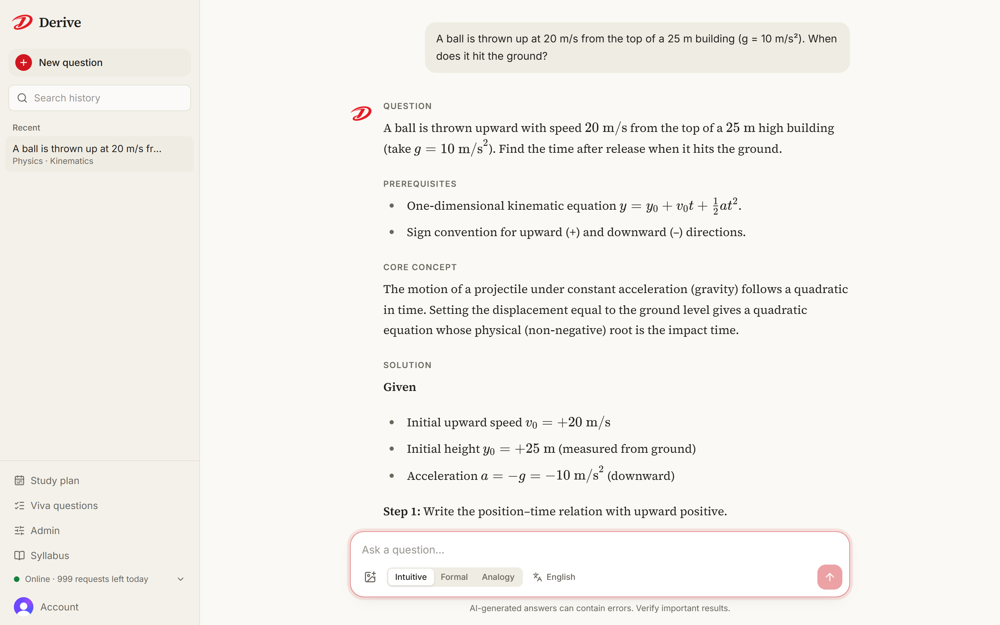
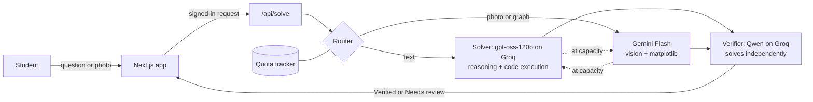
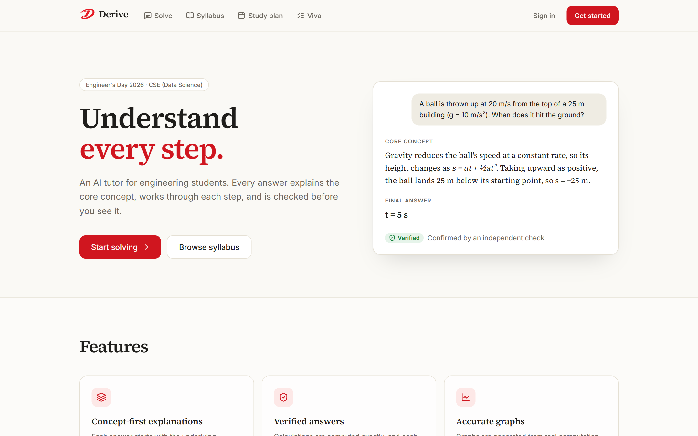
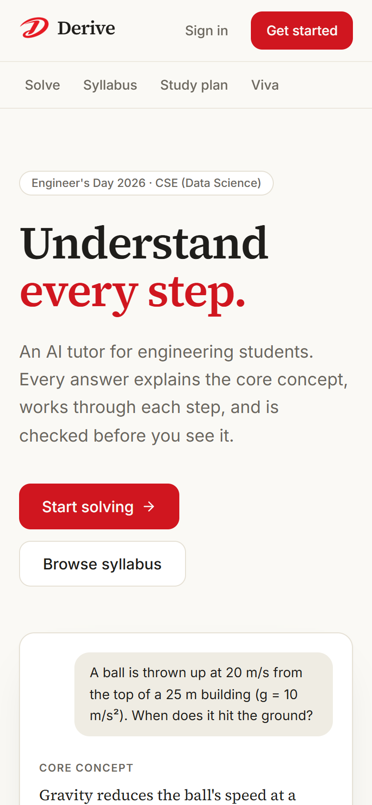

# Derive

**Understand every step.**

Derive is an AI tutor for engineering students. Ask a question in maths, physics, electrical, programming or data science, typed or as a photo, and get a structured explanation: the core concept and where it comes from, a step-by-step solution linked to that concept, and a final answer that is computed exactly and verified independently.

Live at **[deriveai.online](https://deriveai.online)**. Built by Daniyal Sadique (first-year B.Tech CSE, Data Science) for **Engineer's Day 2026**.



## Features

- **Concept-first answers.** Every answer follows the same structure: Question, Prerequisites, Core concept, Solution, Final answer, Verification, Common mistakes, Related concepts and a concept map.
- **Verified answers.** Calculations run in a code sandbox, and a second model solves the question independently. Matching results are marked _Verified_; a result is flagged for review only when a second checker also disagrees.
- **Accurate graphs.** Plotted by running matplotlib, not drawn by the model. Only the final graph is shown, just before the final answer.
- **Circuit diagrams drawn by code.** Simple circuits are drawn with standard symbols from a description of their parts. Well-known devices (a laptop battery pack, a laptop, a charger or SMPS, a UPS or inverter, and a regulated power supply) use checked diagrams built into the app, so the model only writes the explanation.
- **Photo and PDF questions.** Handwritten problems, textbook figures, circuit diagrams and question papers.
- **Maths in questions.** LaTeX such as `\frac{a}{b}` in a question is rendered as real notation.
- **Explanation styles.** Intuitive, Formal or Analogy.
- **Simple English or Hinglish.** Plain English by default; Hinglish on request, with technical terms, formulas and headings kept in English.
- **Follow-up actions.** Go deeper, Simplify, Practice (similar, harder and trick versions), Other methods (with a comparison table) and Explain back (active recall with feedback).
- **Answers in the background.** An answer keeps coming in while you visit other pages, with a marker in the navigation bar until it is ready.
- **History.** Searchable by title or subject, with bookmarks.
- **Syllabus browser.** The official B.Tech Semester I (Group A) syllabus: every course with its code, credits, units and topics, linked to the right page of the PDF.
- **Study plans.** A personalised week-by-week roadmap built only from the syllabus, based on each student's confidence per course, time available, goal and recent questions. Every task is tagged with its course and unit.
- **Viva practice.** Likely viva questions for any course in the syllabus.
- **Admin panel.** Maintenance mode, feature switches, per-student and daily limits, blocking, and live usage and capacity. Open only to the addresses in `ADMIN_EMAILS`, behind a separate username and password.
- **Accounts.** Sign-in with Clerk. The solver and its APIs are available only to signed-in users.

## How answers are verified

Language models can sound confident and still be wrong, especially late in a long conversation. Derive guards against this at every stage:



1. **Reasoning.** A reasoning model works through the problem before writing, under strict rules: exactly one final answer, stated assumptions, and no agreeing with an incorrect claim.
2. **Exact computation.** Numerical results are calculated by code rather than predicted token by token.
3. **Independent check.** A model from a different family solves the question from scratch and compares final answers. Only numeric results are checked, and a disagreement is confirmed by a second checker before the answer is flagged.
4. **Short context.** Only recent turns are sent, and each new question starts a fresh thread, which keeps models from contradicting themselves over long chats.

## Screenshots

| Landing page                                  | Mobile                                        |
| --------------------------------------------- | --------------------------------------------- |
|  |  |

## Tech stack

| Layer          | Choice                                                                    |
| -------------- | ------------------------------------------------------------------------- |
| Framework      | Next.js 16 (App Router), React 19, TypeScript                             |
| Styling        | Tailwind CSS 4, Typography plugin, Inter, Source Serif 4                  |
| Auth           | Clerk                                                                     |
| Solver         | Groq `openai/gpt-oss-120b` with built-in code execution                   |
| Verifier       | Groq `qwen/qwen3.8-27b`, with fallbacks to other models                   |
| Vision, graphs | Google Gemini Flash with code execution (matplotlib)                      |
| Rendering      | react-markdown, KaTeX for maths, Mermaid for block diagrams, SVG circuits |
| Validation     | Zod                                                                       |

## Getting started

**Prerequisites:** Node.js 20+ and API keys from [Google AI Studio](https://aistudio.google.com/apikey) and [Groq](https://console.groq.com/keys).

```bash
git clone https://github.com/daniyalsadique9-commits/derive.git
cd derive
npm install
cp .env.example .env.local                 # add your API keys
npx clerk@latest init --accountless -y     # development auth keys, no account needed
npm run dev
```

Open http://localhost:3000.

Before a demo, run `npm run smoke`. It answers two real questions and prints timings, verification results and remaining quota, confirming that every model is reachable.

### Environment variables

| Variable                           | Purpose                                                              |
| ---------------------------------- | -------------------------------------------------------------------- |
| `GROQ_API_KEYS`                    | Comma-separated Groq keys. Keys from different accounts add quota.   |
| `GEMINI_API_KEYS`                  | Comma-separated Gemini keys. Keys from different projects add quota. |
| `CLERK_*`, `NEXT_PUBLIC_CLERK_*`   | Authentication, written by `clerk init` in development.              |
| `CLERK_JWT_KEY`                    | Optional. Verifies sessions without a network call.                  |
| `GEMINI_RPM`, `GEMINI_RPD`         | Optional. Your Gemini limits, from AI Studio's rate-limit page.      |
| `ADMIN_EMAILS`                     | Comma-separated sign-in emails that can open the admin panel.        |
| `ADMIN_USERNAME`, `ADMIN_PASSWORD` | The second sign-in step for the admin panel.                         |

See [`.env.example`](.env.example) for every option.

## Scripts

| Command             | Description                               |
| ------------------- | ----------------------------------------- |
| `npm run dev`       | Start the development server              |
| `npm run build`     | Production build                          |
| `npm run lint`      | ESLint                                    |
| `npm run typecheck` | TypeScript, no emit                       |
| `npm run format`    | Prettier with Tailwind class sorting      |
| `npm run smoke`     | End-to-end check against the real AI APIs |

Every push to `main` runs the type check and lint on GitHub Actions.

## Project structure

```
src/
├── app/
│   ├── api/solve/        Streaming answer endpoint (NDJSON)
│   ├── api/plan/         Streaming study plan endpoint
│   ├── api/viva/         Streaming viva questions endpoint
│   ├── api/admin/        Admin state, controls and sign-in
│   ├── api/status/       Live capacity report
│   ├── solve/            Solver (signed-in only)
│   ├── plan/             Study plan builder
│   ├── viva/             Viva practice
│   ├── admin/            Admin panel (administrators only)
│   ├── syllabus/         Syllabus browser
│   ├── sign-in/, sign-up/
│   └── page.tsx          Landing page
├── components/
│   ├── solver/           Composer, answers, sidebar, capacity indicator
│   ├── markdown/         Markdown, KaTeX, Mermaid, circuit and schematic rendering
│   └── site/, admin/, brand/, plan/, viva/, syllabus/, ui/
├── lib/
│   ├── ai/               Prompts, providers, fallback routing, quota, verification, checked diagrams
│   ├── client/           Streaming client, conversation state, history, image compression
│   └── server/           Access control, admin settings, rate limiting, streaming responses
├── data/syllabus.ts      Semester syllabus: courses, units, topics and books
└── proxy.ts              Route protection
scripts/smoke.mts         End-to-end pipeline check
```

## Security and privacy

- API keys live only on the server (`.env.local`, git-ignored) and are never sent to the browser.
- `/solve` requires sign-in; `/api/solve` and `/api/status` reject anonymous requests with `401`.
- Each user is rate-limited so one visitor cannot exhaust the shared quota.
- History is stored in the user's own browser. Uploaded photos are not stored, and questions are not logged on the server; the admin panel shows counts only.
- The admin panel needs an administrator's sign-in and a separate username and password, and locks after repeated failed attempts.
- AI providers may use prompts to improve their models, so avoid uploading personal information.

## Deployment

deriveai.online runs on a small Ubuntu server: `npm run build` and `npm start` under systemd, reached through a Cloudflare Tunnel, so no ports are open to the internet. Daily usage counts are saved to `.data/usage.json` and survive restarts.

The app also deploys to Vercel as-is: add the environment variables in the project settings and create a production Clerk instance with `npx clerk@latest deploy`. Quota tracking is in memory, which is exact on a single server and best-effort on serverless hosting; provider fallback still handles rate-limit errors.

## License

[MIT](LICENSE)
